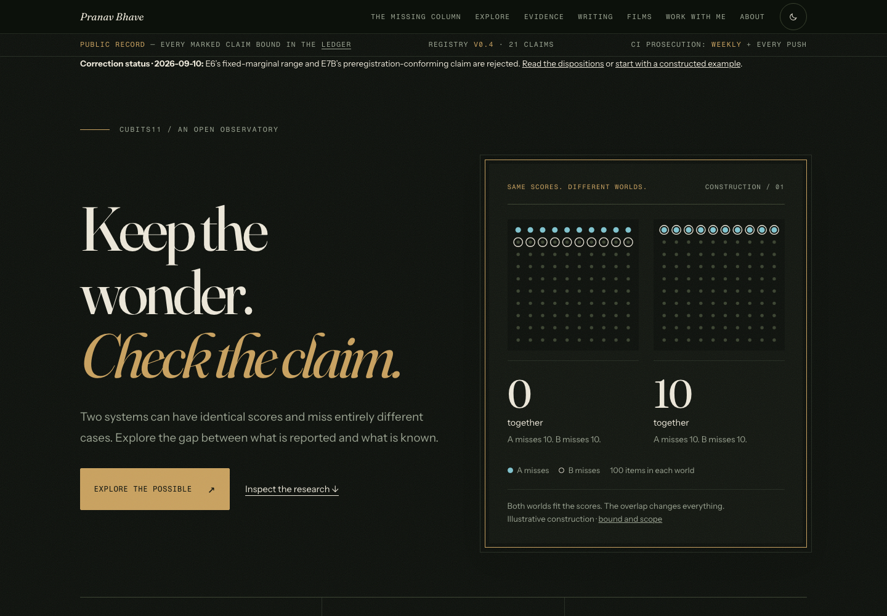
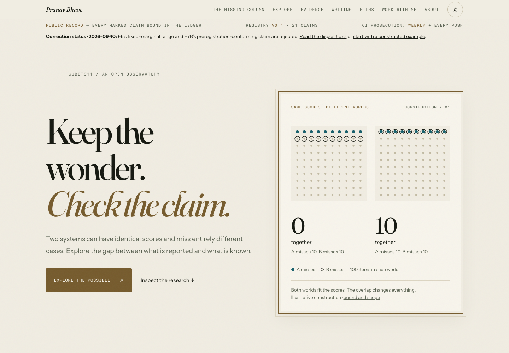
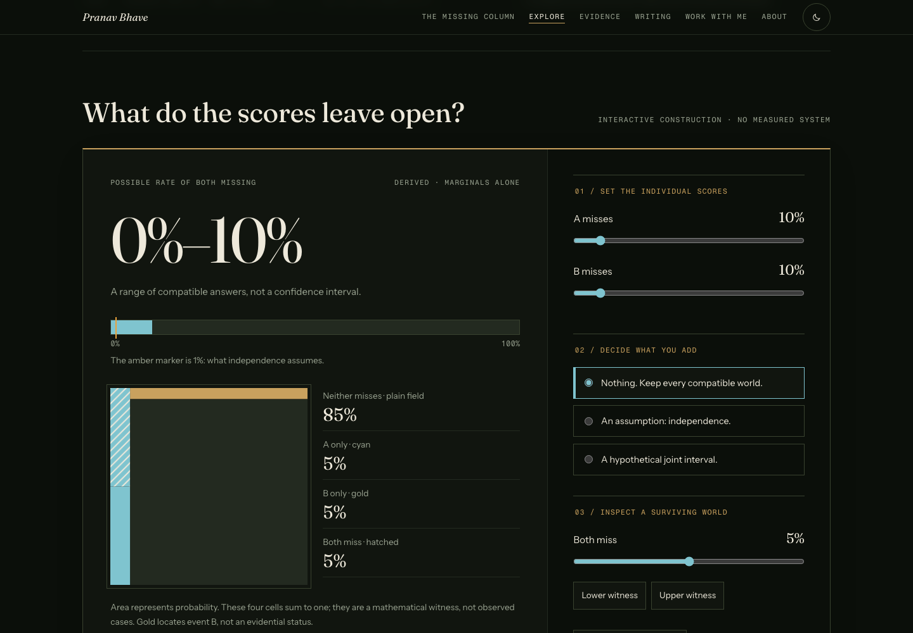

# Observatory design: implementation and rendered observations

This is a dated implementation record, not a governing document, experiment
contract, release policy, or evidence of audience comprehension. Captures were
made during the September 21–22, 2026 session; JSON timestamps are UTC.

## Scope and provenance

Baseline: `21fe5bd0c72ab62014f256c0d8ba5655a952dd50`, the imported
`claude/phone-width-a11y` branch. The baseline screenshots precede design edits.
The final source bytes are bound in [source-hashes.json](source-hashes.json).
Every screenshot, including the preview crops, is bound by SHA-256 in
[SHA256SUMS](SHA256SUMS). The baseline and final JSON files also bind each
full-page screenshot individually.

The changes are concentrated in the homepage and the shared entrance/workbench
stylesheet, which is used by `/` and `/explore/`. No experiment contract,
threshold, observation, claim count, or evidence classification was changed.
The sitemap was regenerated because the imported branch had stale lastmod dates.
The flagship editorial source map was also regenerated: its two Missing Column
page hashes were stale after the imported accessibility patch. Only those hashes
changed; the recording script and scientific numbers did not.
WORLDSPACE also carried a stale QA receipt from the imported accessibility change.
Its existing capture procedure was rerun against the current source: 70 state
captures, keyboard-only checks, and deterministic replay passed with no console
or page errors. The regenerated QA images are included in SHA256SUMS.
Representative phone, desktop-light, and assumption-state images were inspected.

## What changed, and why

- The entrance uses larger editorial typography, a clearer explanation of the
  paired-world example, a direct instrument action, and a brass-framed figure.
  The numbers and their captions have separate typographic roles.
- Three entrance routes form a continuous navigation band. Phone layouts become
  a vertical reading sequence; labels and controls retain practical space.
- The workbench uses the same frame and type hierarchy, larger results, distinct
  display/control surfaces, and legible legends. Selected assumptions have a
  border and inset rule as well as a checked radio control.
- Contradiction messages retain their explicit wording and now have a visible
  invalid-state border. Calculation and scope disclosures become framed panels.
- The film shelves, research headings, and closing statement share the same
  spacing and editorial hierarchy. Existing light/dark evidence colors remain.
- Motion is limited to a short action-arrow movement and state transitions,
  gated by the existing reduced-motion preference. Native controls and static
  fallback content remain in place.

“Luxury” is a design intention here: composition, materials, typography, and
careful states. No participant preference or competitive superiority was measured.

## Rendered observations

[Baseline data](baseline.json), [final data](after.json), and
[layout/interaction observations](interaction-layout.json) contain the results.

| Observation | Result | Boundary |
| --- | --- | --- |
| Before/after captures | 16 full-page images | Homepage and Explore; light/dark; 360×1000 and 1440×1000 |
| Settled contrast scan | No detected violations in all 16 captures | Axe automation has incomplete results; not a conformance claim |
| Initial contrast scan | No detected violations | Taken after load/fonts and axe injection; not a controlled frame during fade |
| Horizontal overflow | None in 320 checks | 80 sitemap routes at 360, 390, 768, 1280; Chromium, reduced motion |
| Browser errors in capture matrix | None | Only errors observed during these loads |
| Keyboard navigation | Passed | Menu activation; Escape close and focus return; range input output update |
| Instrument states | Passed | Independence point, disabled movement, contradictory interval, hidden invalid witness, reset |
| Theme persistence | Passed | Toggle and reload |
| JavaScript disabled | Passed | Visible headings and original static probability range |
| Explore automated accessibility scan | No detected violations | Incomplete contrast/video-caption results remain |

### The fade-in question

For each settled capture, the script visits every `.reveal`, waits, and asserts
that its computed opacity is exactly `1` before scanning again. The recorded
opacity vector is in the JSON. This prevents a screenshot of a hidden section
from being mistaken for its final appearance.

Neither the initial nor settled scan reproduced a homepage contrast violation.
Consequently this session cannot identify an earlier hit as a timing artifact or
as a genuine defect. It establishes only that the hit did not reproduce under
these recorded conditions. No contrast token was changed to mask a scan result.

Axe flags some SVG labels, decorative section numbers, and links with gradient
underlines as requiring manual assessment. Their selectors remain in the data;
zero violations must not be read as every element having been evaluated.
A visual inspection of the desktop and phone previews also caught an oversized
caption wrapping inside the paired-world frame. Separating its numeral and
label fixed it before the final capture.

## Verification

- Frontend structure and keyboard-reachable scroll-region gate: passed.
- Existing world mathematics tests: passed.
- Public discovery regression: passed.
- Repository graph drift check: passed.
- Existing WORLDSPACE capture procedure: passed; receipt and screenshots refreshed.
- Canonical manifest: passed in the isolated environment; see [verification.json](verification.json).
- Clean-clone replay: passed for `2902082b11caafb79e3765fe3618af09d1c891b4`.
  This final report update changes only the observation record; the verified
  design source and screenshot bytes are unchanged.

The initial verification attempt found stale sitemap dates. After regeneration,
a subsequent attempt exposed missing `jsonschema` in the system interpreter.
The declared requirements were installed into an isolated temporary environment
and the canonical manifest was restarted there. Neither failure was called green.
The first clean-clone attempt additionally rejected the attached raw test log
because its historical-ID output lacks the repository’s required same-line
retraction labels. That log attachment was removed and replaced by a concise
verification record; no verifier or historical claim was changed.

## Reproduce the browser observations

Serve the repository locally on port 8765. Install `playwright` and `axe-core`
into a disposable tooling directory and install Playwright Chromium. Expose that
directory's `node_modules` through `NODE_PATH` and run:

```sh
node docs/reports/observatory-design/capture.cjs after
node docs/reports/observatory-design/inspect.cjs
```

The scripts write observations beside this report and overwrite the selected
stage. To reproduce the baseline, serve the baseline commit from a separate
checkout and use `capture.cjs baseline`. Rendering/font/browser differences can
change PNG bytes; the hashes authenticate these captures, not universal pixels.

To verify the retained screenshot bytes from this directory:

```sh
shasum -a 256 -c SHA256SUMS
```

## Limits and the next useful observation

No real-device, Safari, Firefox, screen-reader, human comprehension, or preference
study was performed. Layout scans measure document overflow, not every possible
clipping or interaction problem. The whole-site layout matrix uses reduced
motion; the before/after contrast matrix uses normal motion with settled reveals.
The preview crops use reduced motion. Video-caption automation remains incomplete.

The next useful observation is an unfamiliar visitor attempting the existing
claim/evidence/limit journey without coaching. That can test whether the new
hierarchy improves comprehension. This design work does not constitute an E9
execution, a scientific result, or an independent reproduction.

## Previews






